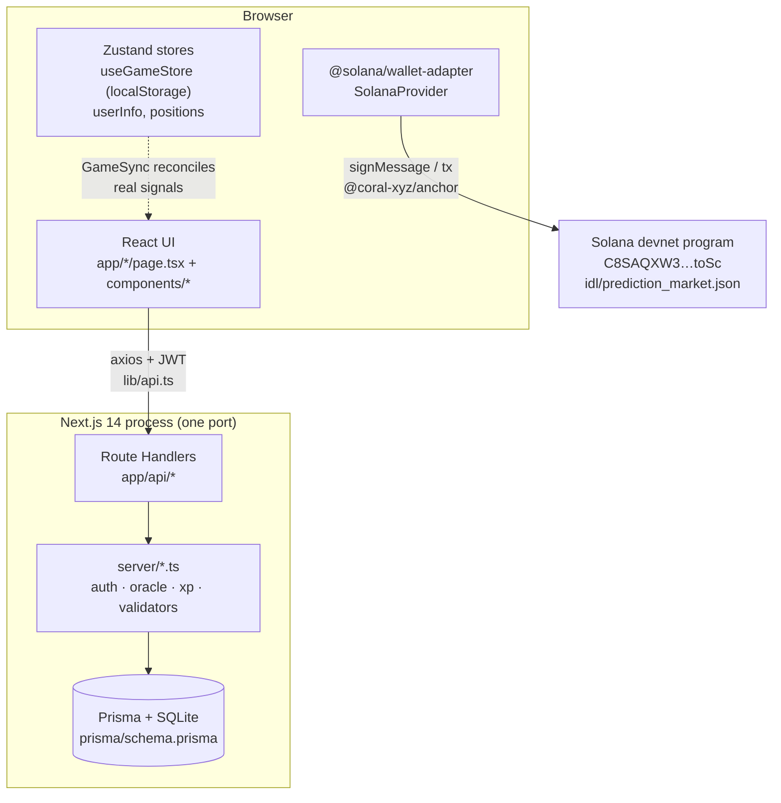
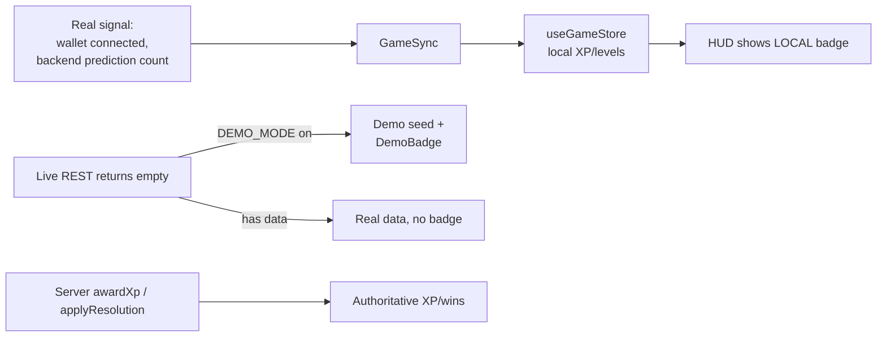
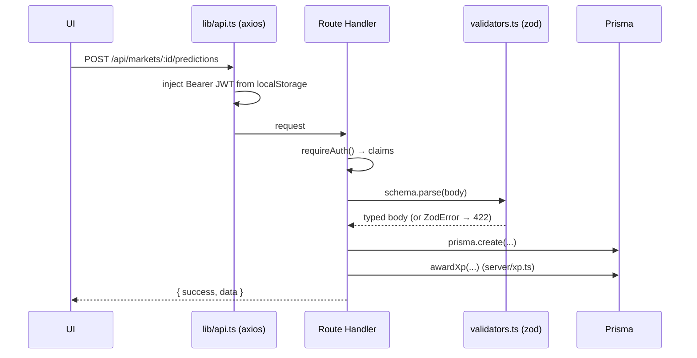

# 01 · Architecture

This page is the system as **layers and boundaries**. For the directory-level
tour see [02-repo-map](./02-repo-map.md); for live flows see
[03-core-flows](./03-core-flows.md).

## A note on a stale doc

`docs/ARCHITECTURE.md` (the older doc) draws the backend as an **external**
service on Render. The current code does **not** match that: the backend lives
**inside this repo** as Next.js Route Handlers under `app/api/*`, backed by
Prisma + SQLite. The README is the accurate one. This wiki documents the code as
it is today. `Source: README.md` (lines 56–59), `Source: app/api/markets/route.ts`,
`Source: prisma/schema.prisma`. (See [12-roadmap](./12-roadmap-and-open-questions.md)
for the discrepancy log.)

The external backend is still *supported* — setting `NEXT_PUBLIC_API_URL` points
the client at a different origin — but the default is same-origin in-repo API.
`Source: config.ts` (`BACKEND_URL`), `Source: lib/game/config.ts` (`API_URL`).

## High-level topology

`Relevant files: app/layout.tsx, app/utils/SolanaProvider.tsx, lib/api.ts,
app/api/markets/route.ts, server/db.ts, app/utils/useProgram.ts`

## The four layers

### 1. UI shell and game layer
The root layout wires the whole app: it mounts the Solana provider, the wallet
auth side-effect, the headless `GameSync` bridge, the XP toast, navbar/footer,
and the page `children`. `Source: app/layout.tsx`.

The "game" is a cross-cutting layer, not a page: `components/game/*` renders the
HUD, mission map, daily quests, rank badge, XP progress and demo/empty/error
states; `lib/game/*` is the data source of truth (levels, ranks, quests, xp,
config). `Relevant files: components/game/PlayerHUD.tsx, components/game/MissionMap.tsx,
lib/game/levels.ts, lib/game/ranks.ts`.

### 2. State (Zustand + localStorage)
Three stores:
- `store/useGameStore.ts` — the persisted progression (`xp`, `completedLevels`,
  `claimedQuests`, `streak`), key `qw-progress-v1`.
- `store/userInfo.ts` — the authenticated backend user.
- `store/usePositionStore.ts` — the player's positions.

`Source: store/useGameStore.ts`. Details in [07-data-and-state](./07-data-and-state.md).

### 3. In-repo API (the authority)
Each `app/api/**/route.ts` is a thin handler that delegates to `server/*.ts`:

- `server/http.ts` — the `ok`/`fail` envelope and the `handler()` wrapper that
  turns Zod errors into `422` and `HttpError` into its status.
- `server/auth.ts` — nonce creation, ed25519 signature verification, JWT issue
  and `requireAuth`/`optionalAuth`.
- `server/oracle.ts` — adapter-based resolution (`dev`/`admin`) + pari-mutuel
  settlement in `applyResolution`.
- `server/xp.ts` — `awardXp` (the single XP path) + `completeLevelServer`.
- `server/validators.ts` — Zod schemas for every request body.
- `server/rateLimit.ts` — async fixed-window limiter behind a `RateLimitStore`
  interface: `MemoryStore` (default) or `RedisStore` (Upstash REST, opt-in). Used
  by the auth routes; **fails open** if the backend is down. `Source: server/rateLimit.ts`.
- `server/monitoring.ts` — provider-agnostic `captureException`/`captureMessage`.
  No-op unless `MONITORING_DSN` is set; wired fire-and-forget into `http.ts`'s
  500 path so a 5xx is reported without ever altering the response.
  `Source: server/monitoring.ts`, `Source: server/http.ts`.
- `server/db.ts`, `server/env.ts`, `server/users.ts`, `server/quests.ts`,
  `server/markets.ts`, `server/audit.ts`.

Handlers declare `runtime = "nodejs"` and `dynamic = "force-dynamic"`.
`Source: app/api/markets/route.ts`. Surface map in
[06-api-and-interfaces](./06-api-and-interfaces.md).

### 4. On-chain (Solana / Anchor)
Two distinct things — do not confuse them:

| | Deployed devnet program | Reference scaffold |
| --- | --- | --- |
| Program id | `C8SAQXW3qhWTT1uGdpSegU466qTQAKQs3JB15TQ8toSc` | placeholder `Quantum111…` |
| Where | consumed via `idl/prediction_market.json` | `contracts/quantum_wager/` source |
| Scope | markets, battles, tokens, bonding curves, reputation | minimal escrow: init/bet/resolve/claim |
| Used by | `app/utils/methods.tsx` via `useProgram()` | `anchor test` / your own deploy |

`Source: config.ts` (`PROGRAM_ID`), `Source: idl/prediction_market.json`,
`Source: contracts/quantum_wager/programs/quantum_wager/src/lib.rs`,
`Source: app/utils/useProgram.ts`.

## The honesty boundary (the load-bearing design rule)

The rule, stated three ways in the code:
- *Progression is local and labelled.* `Source: lib/game/config.ts`.
- *Demo only as fallback, always badged, never merged into live.*
  `Source: docs/SECURITY_NOTES.md`, `Source: lib/game/config.ts`.
- *XP/wins/resolution server-side only.* `Source: server/xp.ts`,
  `Source: server/oracle.ts`.

## Request lifecycle (typical authed write)

`Relevant files: lib/api.ts, server/auth.ts, server/validators.ts, server/http.ts,
server/xp.ts`. Walked step by step in [03-core-flows](./03-core-flows.md).
