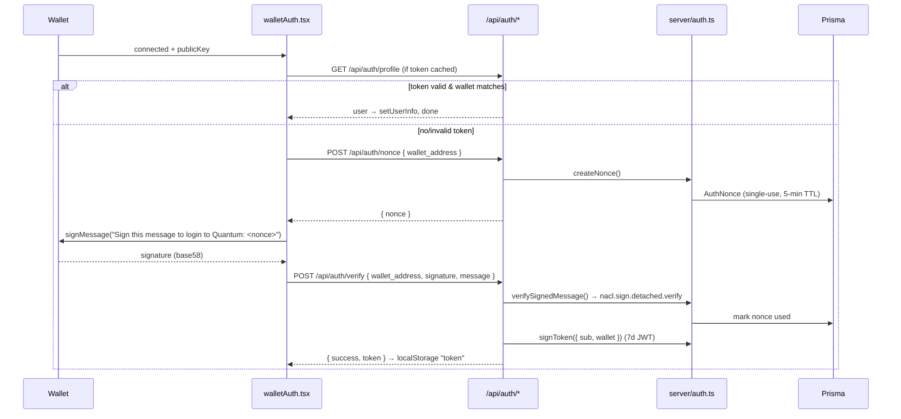
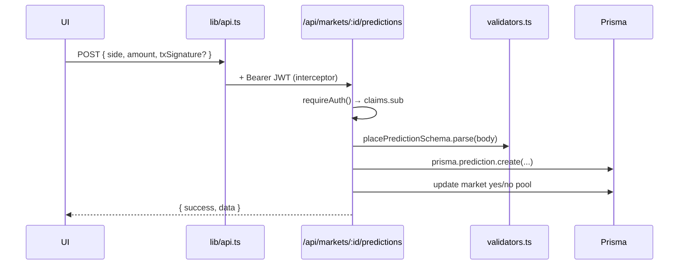
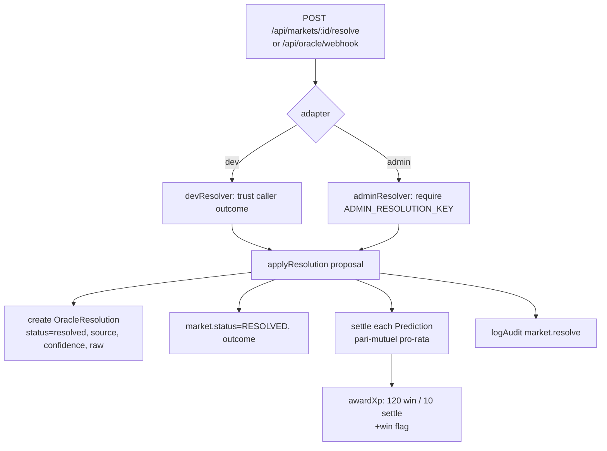

# 03 · Core Flows

Real flows traced through real code. Each step cites the file that does the work.

## Flow A — App startup

What happens when the page loads, top to bottom in `app/layout.tsx`:

1. `<RouteProgress/>` — nprogress bar on navigation. `Source: app/utils/hooks/routeProgress.tsx`.
2. `<SolanaProvider>` — wallet adapter + RPC connection context wraps everything.
   `Source: app/utils/SolanaProvider.tsx`.
3. `<Navbar/>` — global nav (includes the HUD). `Source: components/marketing/Navbar.tsx`.
4. `<WalletAuth/>` — headless; runs the sign-in effect when a wallet connects
   (Flow B). `Source: app/utils/walletAuth.tsx`.
5. `<GameSync/>` — headless; reconciles real signals into the progression store
   and pulls server progress (Flow D). `Source: components/game/GameSync.tsx`.
6. `<XPToast/>` — renders one-shot XP/level toasts from the store.
   `Source: components/game/XPToast.tsx`.
7. `<main>{children}</main>` + `<Toaster/>` + `<Footer/>`.

`Source: app/layout.tsx`.

## Flow B — Wallet sign-in (real auth)

Key facts:
- The message signed is literally `WALLET_AUTH_MESSAGE + nonce`.
  `Source: server/auth.ts` (`buildAuthMessage`), `Source: app/utils/walletAuth.tsx`.
- Verification rejects unless the nonce exists, is **unused**, **unexpired**, and
  belongs to that wallet, **and** the ed25519 signature checks out. The nonce is
  marked `used` only on success. `Source: server/auth.ts` (`verifySignedMessage`).
- The JWT (`{ sub: userId, wallet }`, 7-day TTL) is signed with `JWT_SECRET`.
  Every subsequent request carries it via the axios interceptor.
  `Source: server/auth.ts` (`signToken`), `Source: lib/api.ts`.
- The `nonce` and `verify` handlers first `await rateLimit(...)` (30/min and
  20/min respectively) to blunt nonce spam / brute force. It is a no-op unless
  `RATE_LIMIT_ENABLED="true"` and fails open if its backend is down.
  `Source: app/api/auth/nonce/route.ts`, `Source: server/rateLimit.ts`.

> Note: `walletAuth.tsx` posts to `/api/auth/verify` (a legacy alias) and reads
> `res.data.user.wallet_address`. The REST docs list `verify-wallet` as the
> canonical endpoint with `verify` as its alias. `Source: docs/API.md`.

## Flow C — Place a prediction (authed write)

- `requireAuth` throws `401` if the bearer token is missing/invalid.
  `Source: server/auth.ts`.
- The body is validated by `placePredictionSchema`
  (`side: YES|NO`, positive `amount` ≤ 1,000,000, optional `txSignature`).
  `Source: server/validators.ts`.
- `txSignature` is optional — the app can record an on-chain stake tx, but the
  DB prediction is the canonical record for settlement. `Source: prisma/schema.prisma`
  (`Prediction.txSignature`).

## Flow D — Progression: how a level actually completes

The progression layer is local, but it only advances from **real** signals.

1. `GameSync` reads `connected/publicKey` (wallet) and a backend prediction
   count, then calls `syncFromBackend({ hasWallet, predictionCount })`.
   `Source: components/game/GameSync.tsx`.
2. The store completes **Level 1** (`connect-wallet`) when a wallet is truly
   connected, and **Level 2** (`first-prediction`) when `predictionCount > 0` —
   never a fake pass. `Source: store/useGameStore.ts` (`syncFromBackend`),
   `Source: docs/GAME_LOOP.md`.
3. Levels 3–6 currently complete from in-app actions on their screens (e.g.
   `components/game/CompleteLevelOnMount.tsx`); the design intent is to wire them
   to real signals the same way. `Source: docs/GAME_LOOP.md`.
4. When authenticated, `GameSync` also pulls `GET /api/player/progress` and
   `hydrateServer`s it — **server XP wins** (it takes `Math.max(serverXp, localXp)`),
   completed levels are unioned. `Source: components/game/GameSync.tsx`,
   `Source: store/useGameStore.ts` (`hydrateServer`).

Completing a level/quest pushes a `lastToast` that `<XPToast/>` renders once.
`Source: store/useGameStore.ts`.

## Flow E — Market resolution + settlement (server authority)

This is where value is granted, so it is entirely server-side.

Mechanics, from `server/oracle.ts`:
- **Outcomes are never invented.** A resolver *adapter* proposes an outcome;
  `dev` trusts the caller, `admin` requires `ADMIN_RESOLUTION_KEY`. A future
  provider adapter (Pyth/Switchboard) implements the same interface.
- **Pari-mutuel payout:** `payout = (stake / winnersStake) * totalPool`. Losers
  get `0`. `Source: server/oracle.ts` (`applyResolution`).
- **XP:** winners get `120` XP + a win; everyone else gets `10` ("consolation
  keeps losers engaged"). Granted via `awardXp`. `Source: server/oracle.ts`,
  `Source: server/xp.ts`.
- Resolving an already-`RESOLVED` market throws. `Source: server/oracle.ts`.

### Inside `awardXp` (the single XP path)
`Source: server/xp.ts`:
1. Append an immutable `XPEvent` (auditable ledger).
2. Upsert `PlayerProfile`, recompute `xp`, `rankId` (via `getRank`), `wins`/`losses`.
3. Upsert the active-season `LeaderboardEntry` so the leaderboard is derived from
   real XP/wins.
4. `logAudit("xp.award")`.

This is why the leaderboard is trustworthy while the HUD XP is "local": the
leaderboard reads server-side `LeaderboardEntry`, the HUD reads `useGameStore`.

## Flow F — On-chain bet (the real escrow path)

The deployed program is consumed in the browser, not the server.

1. `useProgram()` builds an Anchor `Program` from `idl/prediction_market.json`
   using `useAnchorWallet()` and a `Connection` to `SOLANA_RPC_URL` from
   `lib/solana` (the same endpoint `SolanaProvider` uses — no RPC drift).
   `Source: app/utils/useProgram.ts`, `Source: lib/solana.ts`.
2. `app/utils/methods.tsx` composes instructions using the constants in
   `config.ts` (fees, min/max bet, durations, bonding-curve params) and the
   `treasury`/`battlePoolVault` pubkeys. Decoded account fetchers are now typed
   against the IDL (`IdlAccounts<PredictionMarket>`), and the battle/portfolio UI
   coerces decoded values at the edge (PublicKey→base58, BN→string,
   option→`undefined`) instead of assuming hand-written shapes.
   `Source: app/utils/methods.tsx`, `Source: app/battlearena/[pda]/page.tsx`,
   `Source: app/portfolio/battle/[pda]/page.tsx`, `Source: config.ts`.

The **reference** program (`contracts/quantum_wager`) shows the canonical escrow
shape this mirrors: `initialize_market → place_bet (escrow into vault PDA) →
resolve_market (authority sets outcome after end_ts) → claim_winnings (pari-mutuel
out of the vault)`. `Source: contracts/quantum_wager/programs/quantum_wager/src/lib.rs`.

> The deployed program (`C8SAQXW3…toSc`) is richer than the reference scaffold
> (it includes battles, tokens, bonding curves, reputation per `config.ts` and
> the IDL). The reference program is the auditable minimal core, not a 1:1 copy.

## Flow G — Demo fallback (the honesty path)

`Source: lib/useMarkets.ts`, `Source: lib/demo/markets.ts`,
`Source: lib/game/config.ts`:
1. A screen asks `useMarkets()` for data.
2. If the live source returns rows → render them, `source: "live"`, no badge.
3. If it returns nothing **and** `DEMO_MODE` is on → render seed data,
   `source: "demo"`, with a `<DemoBadge/>`.
4. If empty and not in demo mode → an empty/error state. Demo data is **never**
   merged into live data.
