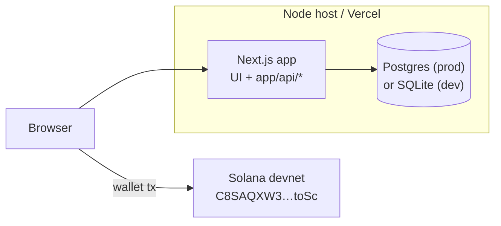

# 09 · Deployment

Three deployable artifacts, but two of them ship together. The frontend **and**
the backend are one Next.js app, so deploying the app deploys the API. The
contract is separate.

## 1. Frontend + backend (one Next.js app)

Standard Next.js — deploys to Vercel or any Node host. `Source: README.md`.

```bash
# Vercel
vercel            # preview
vercel --prod     # production

# Or any Node host
pnpm build
pnpm db:migrate:deploy   # apply migrations to the production database
pnpm db:seed             # optional: demo data
pnpm start
```

### Required production env
`Source: README.md`, `Source: .env.example`, `Source: server/env.ts`:

| Var | Why |
| --- | --- |
| `NEXT_PUBLIC_API_URL` | live backend URL (or empty for same-origin) |
| `NEXT_PUBLIC_APP_MODE=production` | disables demo fallbacks |
| `NEXT_PUBLIC_SOLANA_NETWORK=devnet` | network |
| `NEXT_PUBLIC_SOLANA_RPC_URL` | reliable devnet RPC |
| `DATABASE_URL` | **Postgres in prod** (see below) |
| `JWT_SECRET` | strong value — boot refuses the dev default |
| `WALLET_AUTH_MESSAGE` | sign-in message prefix |
| `ADMIN_RESOLUTION_KEY` | resolver/oracle key — change it |
| `ORACLE_MODE` | `dev`/`admin`/`provider` |

### The serverless / SQLite caveat
SQLite's local file is **not durable** on serverless hosts (e.g. Vercel). For
production, point `DATABASE_URL` at managed **Postgres** and change the Prisma
datasource `provider` from `sqlite` to `postgresql` in `prisma/schema.prisma`,
then re-run migrations. `Source: README.md`, `Source: prisma/schema.prisma`.

## 2. Database

```bash
pnpm db:migrate:deploy   # prisma migrate deploy (idempotent, CI/prod-safe)
pnpm db:seed             # optional DEMO data
```

Migrations are committed under `prisma/migrations/`; the `.db` file is not.
`Source: package.json`, `Source: .gitignore`, `Source: prisma/migrations/`.

## 3. Solana contract (devnet)

> ⚠️ **Devnet only.** No mainnet without audit + economic + legal review.
> `Source: docs/SECURITY_NOTES.md`,
> `Source: contracts/quantum_wager/programs/quantum_wager/src/lib.rs` (header).

The prediction-market program is **already deployed** to devnet
(`C8SAQXW3qhWTT1uGdpSegU466qTQAKQs3JB15TQ8toSc`); the frontend consumes its IDL.
You normally do **not** redeploy — just point the app at devnet.
`Source: docs/DEVNET_DEPLOYMENT.md`, `Source: idl/prediction_market.json`.

To build/deploy your own (from the reference workspace):

```bash
solana config set --url https://api.devnet.solana.com
solana airdrop 2

cd contracts/quantum_wager
anchor build
anchor keys sync            # align declare_id! with the new keypair
anchor deploy --provider.cluster devnet

# Copy regenerated IDL + types back into the app
cp target/idl/prediction_market.json  ../../idl/
cp target/types/prediction_market.ts  ../../idl/types.ts
```

Then update `NEXT_PUBLIC_PROGRAM_ID` **and** `config.ts` `PROGRAM_ID` to the new
id. `Source: docs/DEVNET_DEPLOYMENT.md`, `Source: contracts/quantum_wager/Anchor.toml`.

Verify a deployed program:
```bash
solana program show C8SAQXW3qhWTT1uGdpSegU466qTQAKQs3JB15TQ8toSc --url devnet
```
`Source: docs/DEVNET_DEPLOYMENT.md`.

## Deployment topology



## Pre-deploy checklist

- [ ] `pnpm build` clean, `pnpm typecheck` clean.
- [ ] Strong `JWT_SECRET` and non-default `ADMIN_RESOLUTION_KEY` set.
- [ ] `DATABASE_URL` → durable Postgres; Prisma `provider` switched.
- [ ] `pnpm db:migrate:deploy` run against the prod DB.
- [ ] `NEXT_PUBLIC_APP_MODE=production` (demo off) unless intentionally demoing.
- [ ] Reliable devnet RPC in `NEXT_PUBLIC_SOLANA_RPC_URL`.

`Source: README.md`, `Source: server/env.ts`, `Source: docs/SECURITY_NOTES.md`.
